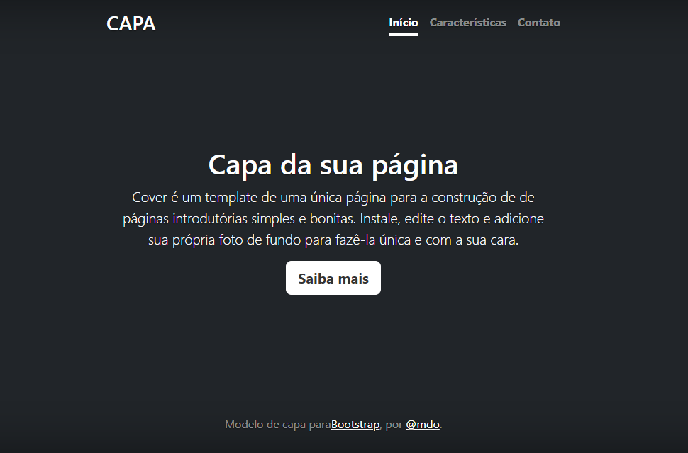

# Índice

 

[ Projeto - portifolio para escrita do README](#projeto---portifolio-para-escrita-do-readme)  
[Desrição](#descri%C3%A7%C3%A3o)  
[Funcionalidades](#funcionalidades)  
[Tecnologioa utilizadas](#tecnologioa-utilizadas)  
[Fontes consultadas](#fontes-consultadas)  
[Autores](#autores)  

# 🚀 Projeto - Portfólio para escrita do README

## 📋 Descrição

 Projeto desenvolvido durante a disciplina de Programação Web para a realização de um README e da aplicação de uma página utilizando Bootstrap como exemplo de página responsiva.

 ## :hammer: Funcionalidades do projeto

- `Página responsiva`: os objetos dentro da tela de capa se adaptam ao formato adaptável conforme a tela escolhida/utilizada pelo usuário.  
- `README descritivo e bem-feito`: o arquivo README da aplicação é dividido em seções e apresenta grande descritividade.  

### ⚙️ Tecnologias utilizadas

 `HTML` 
- `CSS`
 `GitHub`
 `Bootstrap 5`

## 📄 Fontes consultadas

 

## ✒️ Autores